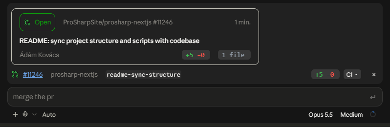
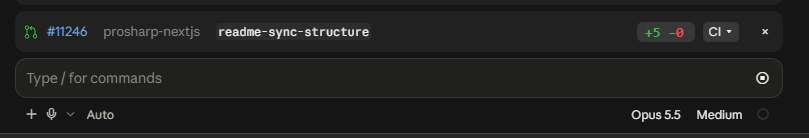
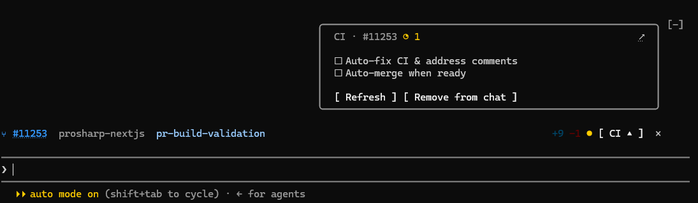
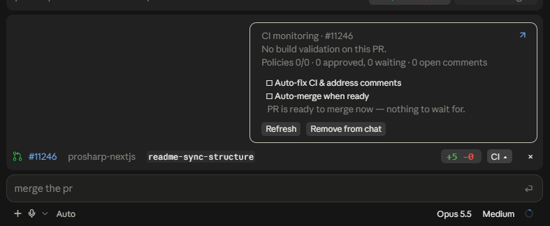
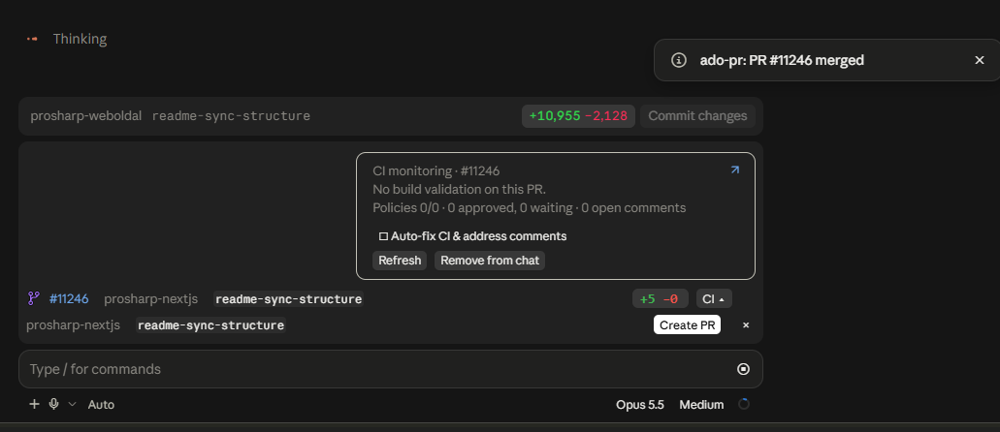
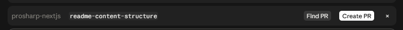
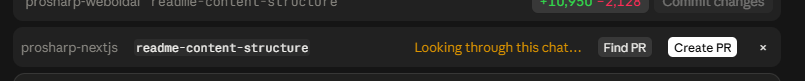
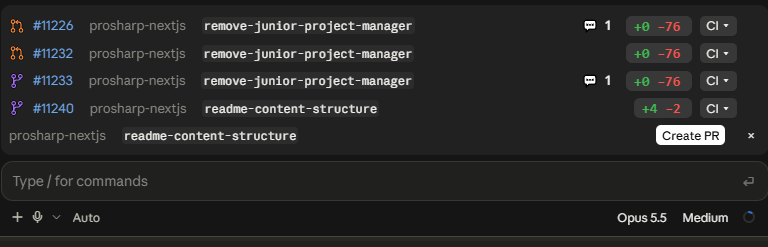
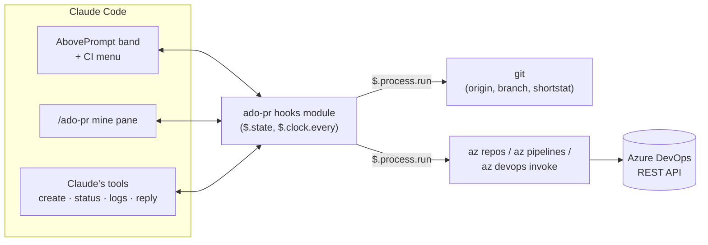

<div align="center">

# Azure DevOps Pull Requests Bar - Claude mod

**Azure DevOps pull requests in Claude Code: the same PR bar the desktop app shows for GitHub, built on the Azure CLI.**

[](https://code.claude.com/docs)
[](https://learn.microsoft.com/en-us/azure/devops/cli/)
[](LICENSE)



</div>

When you work on a GitHub repository, Claude Code Desktop shows a bar above the prompt with the branch's pull request: its number, its `+/−` lines, a CI indicator with a dropdown, and switches for **Auto-fix CI** and **Auto-merge**. Azure Repos gets none of that.

**Azure DevOps Pull Requests Bar** (plugin id `ado-pr`) is a [Claude Code mod](https://claude.dev/blog/getting-started-with-claude-code-mods/) that draws the same bar for **Azure DevOps**, using only `az` and `git` on your machine.

> **Bar missing in a chat?** Each chat shows the PRs it created. For a chat that made its PR before you installed the plugin, or one Claude opened some other way:
>
> - `/ado-pr find` (or the **Find PR** button) looks through the chat's history and adds every PR of this repository it mentions.
> - `/ado-pr link <id>` adds any PR by its number, for example `/ado-pr link 1234`.
>
> All commands are listed under [Commands](#commands).

## See it in action

**A bar for the chat's pull request**, right above the prompt: state icon, `#id`, repository, source branch, `+/−` lines and the CI panel.



The whole feature set works in **CLI as well.**




**Hover `#id`** for the summary card, as in the screenshot at the top: state, title, author, `+/−` and the number of files.

**Click CI ▾** for the CI panel: build validations, policies and reviewers, and the **Auto-fix CI & address comments** and **Auto-merge when ready** switches.




**When the PR merges** you get a notice, the icon turns purple, and **Create PR** comes back for the next one.



**Older chats** offer **Find PR**, which looks through the chat's history for the pull requests it created.




**Every PR the chat has made** gets its own bar, each on its own branch. Orange is abandoned, purple is merged, green is open.



## Features

|                                               | GitHub (built into Desktop) | **This plugin** (Azure DevOps)                                                     |
| --------------------------------------------- | --------------------------- | ---------------------------------------------------------------------------------- |
| PR bar above the prompt: number, repo, branch | ✅                          | ✅ green open · grey draft · purple merged · orange abandoned                         |
| `+added −removed` lines                       | ✅                          | ✅ from `git diff --shortstat` of the PR's merge commits                           |
| CI dot and dropdown with check counts         | ✅                          | ✅ build validation and status policies, each linked to its run                    |
| **Create PR** button                          | ✅                          | ✅ Claude pushes, writes the title and description, opens the PR                   |
| Auto-fix CI                                   | ✅                          | ✅ failed build logs (errors and log tail) handed to Claude                        |
| Address review comments                       | ✅                          | ✅ unresolved threads handed to Claude, who replies and resolves them              |
| Auto-merge when ready                         | ✅                          | ✅ Azure DevOps **auto-complete** (squash or merge commit, optional branch delete) |
| PR state in the sidebar for every chat        | ✅                          | ❌ not possible for a mod; `/ado-pr mine` lists your PRs in a pane instead         |
| Live updates                                  | webhooks                    | polling (60 s by default), plus a refresh after every prompt, turn and `git push` |
| Hover card on `#id`                           | ✅                          | ✅ state badge, title, author, `+/−`, file count                                   |
| Several PRs per chat                          | ✅                          | ✅ one bar each, kept with the chat; **Find PR** adds the ones from older chats     |

Claude also gets four tools it can call: `create_pull_request`, `pull_request_status`, `build_failure_logs` and `reply_to_pr_comment`.

## Requirements

- **Claude Code 2.1.287 or later** (mods are on by default from that version), in the terminal or the desktop app's Code tab
- **Azure CLI** with the **azure-devops** extension
  ```bash
  az extension add --name azure-devops
  ```
- Signed in, either with your Microsoft Entra account or a PAT
  ```bash
  az login
  ```
  ```bash
  az devops login --organization https://dev.azure.com/<your-org>
  ```
- A git clone whose `origin` is Azure Repos. Every URL form works: `https://dev.azure.com/…`, `https://<org>.visualstudio.com/…`, and SSH `git@ssh.dev.azure.com:v3/…`

The organization, project and repository come from `origin`, so you don't need `az devops configure --defaults`.

## Install

At the prompt of a Claude Code **terminal** session:

```text
/plugin install ado-pr --marketplace Pro-Sharp/ado-pr-claude-plugin
```

Answer `y` to add the marketplace and pick the **user** scope. The mod is active immediately and loads in every later session, including the desktop app's Code tab.

<details>
<summary>Other ways to install</summary>

Add the marketplace first, then install from it:

```text
/plugin marketplace add Pro-Sharp/ado-pr-claude-plugin
/plugin install ado-pr@azure-devops-pr
/reload-plugins
```

Run it from a local clone for a single session:

```bash
claude --plugin-dir ./plugins/ado-pr
```

Load a local clone in every session, desktop included. Add this to `~/.claude/settings.json`:

```json
{
  "env": {
    "CLAUDE_CODE_PLUGIN_DIRS": "C:/path/to/ado-pr-claude-plugin/plugins/ado-pr"
  }
}
```

</details>

## Updating

An installed copy doesn't follow the repository by itself. To get the latest release:

```bash
claude plugin marketplace update azure-devops-pr
```

```bash
claude plugin update ado-pr
```

Then run `/reload-plugins` in an open session, or start a new one. [CHANGELOG.md](CHANGELOG.md) lists what changed in each version.

Running from a local clone (`--plugin-dir`, `CLAUDE_CODE_PLUGIN_DIRS`, or a marketplace added from a folder)? Pull the changes and run `/reload-plugins`; there's nothing to update.

## Usage

Open a session in an Azure Repos clone.

- **Each chat has its own PRs.** A chat shows a bar for every PR it created, found or linked, open or closed, whatever branch the folder is on now. Two chats of the same repository never show each other's PRs. A chat can hold several PRs (one abandoned, a newer one open, each on its own branch), one bar each.
- **A chat without an open PR** shows the current branch with **Find PR** and **Create PR**.
  - **Find PR** looks through the chat's own history for PR links and ids, keeps the ones from this repository, and adds a bar for each. Use it in chats from before 0.3.0.
  - **Create PR**: Claude commits and pushes the branch, writes a title and description from the diff, and opens the PR through its `create_pull_request` tool. Asking Claude for a PR in plain words does the same. A PR Claude opens with `az repos pr create` is added too.
- **Each bar**: hover `#id` for a summary card (state, title, author, `+/−`, files), and click it to open the PR in Azure DevOps. Click **CI ▾** to open that PR's CI panel. **Remove from chat** in the panel takes the bar away. Cards and panels open inside the bar area, which grows upward from the prompt: a mod can't draw over the chat.
- **×** hides the bar for the session. `/ado-pr show` brings it back.

### The CI popover

| Control                               | What it does                                                                                                                                                                                                                                                                                          |
| ------------------------------------- | ----------------------------------------------------------------------------------------------------------------------------------------------------------------------------------------------------------------------------------------------------------------------------------------------------- |
| **Auto-fix CI & address comments**    | Each build validation that fails is handed to Claude **once**, with the failed steps, their `##[error]` lines and the log tail. Unresolved review threads are handed over too. Claude fixes the code, pushes, and replies on each thread. Turning it on also acts on what is already failing or open. |
| **Auto-merge when ready**             | Turns Azure DevOps **auto-complete** on or off (`az repos pr update --auto-complete`). The PR then completes by itself once every required policy passes.                                                                                                                                             |
| **Fix CI now** / **Address comments** | Run the same hand-over once, on demand.                                                                                                                                                                                                                                                               |
| **Publish draft**                     | Takes a draft PR out of draft.                                                                                                                                                                                                                                                                        |

### Commands

| Command                       |                                                                                          |
| ----------------------------- | ---------------------------------------------------------------------------------------- |
| `/ado-pr` or `/ado-pr status` | Re-read and summarize the PR                                                             |
| `/ado-pr refresh`             | Re-read now                                                                              |
| `/ado-pr create`              | Same as the **Create PR** button                                                         |
| `/ado-pr find`                | Same as **Find PR**: add the PRs this chat's history mentions                            |
| `/ado-pr link <id>`           | Add any PR to this chat                                                                  |
| `/ado-pr unlink [id]`         | Remove one PR from this chat, or all of them                                             |
| `/ado-pr fix`                 | Hand the failed builds to Claude now                                                     |
| `/ado-pr comments`            | Hand the unresolved comments to Claude now                                               |
| `/ado-pr mine`                | Open a pane with your PRs in this project                                                |
| `/ado-pr show`                | Show the bar again after **×**                                                           |

## Configuration

`/config` shows these options under **Azure DevOps Pull Requests Bar** (`ado-pr`). You can also set them in `settings.json` under `pluginConfigs["ado-pr"].options`.

| Option               | Default   |                                                                                                         |
| -------------------- | --------- | ------------------------------------------------------------------------------------------------------- |
| `pollSeconds`        | `60`      | How often the PR, its builds and its comments are re-read. `0` turns polling off.                       |
| `mergeStrategy`      | `squash`  | `squash` or `noFastForward` (a merge commit), used by **Auto-merge when ready**.                        |
| `deleteSourceBranch` | `false`   | Delete the source branch when auto-complete merges.                                                     |
| `azPython`           | _(empty)_ | Windows only: path to the Azure CLI's bundled `python.exe`, when it isn't in the standard MSI location. |

## How it works



The mod has no server and handles no tokens. Every call is an `az` or `git` command run as you, and `az` uses the sign-in it already has. [docs/az-cli-mapping.md](docs/az-cli-mapping.md) lists the command behind each feature. [docs/architecture.md](docs/architecture.md) describes the module layout and the event flow.

## Limitations

- **Sidebar badges.** Desktop draws the PR state in the sidebar for GitHub sessions, but the sidebar is part of the desktop app itself, not something a mod can draw. `/ado-pr mine` is the substitute.
- **Events are polled.** GitHub sessions get webhook-driven events. Azure DevOps service hooks can't reach a local session, so the mod re-reads every `pollSeconds` and right after any `git push`, `git checkout`/`switch` or `az repos pr` command Claude runs.
- **`+/−` needs the commits locally.** When the PR's commits aren't in your clone, the mod fetches them once. If the fetch fails, the counts are left out.
- **No Create PR on the default branch.** Create a feature branch first.
- **Auto-fix trusts what reviewers write.** Comment text and build logs are handed to Claude as instructions to act on. Leave the switch off on repositories where untrusted people can comment. [SECURITY.md](SECURITY.md) has more.

## Troubleshooting

| You see                                 | Fix                                                                                                                                                  |
| --------------------------------------- | ---------------------------------------------------------------------------------------------------------------------------------------------------- |
| `Not signed in to Azure DevOps`         | `az login`, or `az devops login` with a PAT that has _Code (read & write)_ and _Build (read)_ scopes                                                 |
| `The azure-devops extension is missing` | `az extension add --name azure-devops`                                                                                                               |
| `Could not start the Azure CLI`         | Install it from https://aka.ms/azcli. On Windows with a non-MSI install, set the `azPython` option.                                                  |
| Garbled accented names on Windows       | Make sure the mod found the bundled `python.exe` (it adds `-X utf8`). Set `azPython` if your install is elsewhere.                                   |
| No bar at all                           | Check that `origin` is an Azure Repos URL (`git remote get-url origin`) and run `/ado-pr status`. Start `claude --debug` to see the mod's log lines. |

## Development

```bash
claude plugin validate plugins/ado-pr
```

```bash
claude plugin test plugins/ado-pr
```

```bash
claude --plugin-dir ./plugins/ado-pr
```

Saving a file reloads the mod in a running session. Claude Code writes its own type declarations to `plugins/ado-pr/.claude-plugin/types/` each time it loads the mod, and after that `tsc -p plugins/ado-pr` type-checks the mod. [CONTRIBUTING.md](CONTRIBUTING.md) has the details. [docs/research.md](docs/research.md) records what we found about Claude Code's own GitHub integration and how to track upstream changes.

## Contributing

Issues and pull requests are welcome. Please read [CONTRIBUTING.md](CONTRIBUTING.md) and the [Code of Conduct](CODE_OF_CONDUCT.md) first.

## License

[MIT](LICENSE) © Adam Kovacs

---

<sub>Not affiliated with or endorsed by Anthropic or Microsoft. "Claude" is a trademark of Anthropic. "Azure DevOps" is a trademark of Microsoft. Mods run with Claude Code's access to your machine, so read the source before you install any of them, this one included.</sub>
