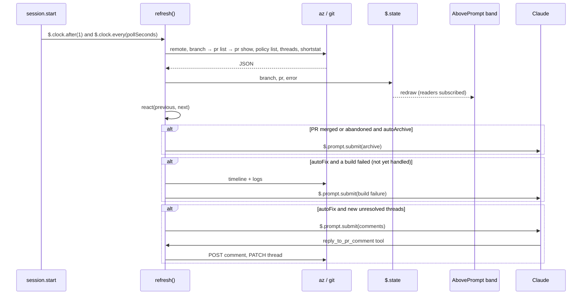

# Architecture

```text
plugins/ado-pr/
├── .claude-plugin/plugin.json   manifest, userConfig options, the state contract's path
├── hooks/
│   ├── hooks.json               { "modules": ["./register.tsx"] }
│   ├── register.tsx             hooks: band, CI menu, pane, commands, tools, polling
│   ├── ado.ts                   the az/git layer; takes an exec function, so tests can stand in for it
│   ├── status.ts                pure: policy → check, rollup, comments, shortstat, phase
│   ├── remote.ts                pure: Azure Repos remote URL parsing
│   └── prompts.ts               what Claude is asked for Create PR, auto-fix, comments, archive
├── types/index.d.ts             $.state contract (PluginState['ado-pr'])
└── tests/                       claude plugin test: unit tests plus a mounted band on terminal and desktop
```

The Azure layer (`ado.ts`, `status.ts`, `remote.ts`) knows nothing about Claude Code's UI. `register.tsx` is the only file that touches `$`.

## State

All drawing reads from `$.state`, so a hot reload keeps what the bar shows:

| Key | |
|---|---|
| `branch` | org, project, repo and branch from `origin`, or `null` outside Azure Repos |
| `pr` | the last `PrSnapshot` (see `types/index.d.ts`) |
| `pinnedId` | a PR bound with `/ado-pr link`, which wins over the branch lookup until the branch changes |
| `error` | the last `az` error, already turned into an instruction |
| `busy` | a label while a menu action runs |
| `isMenuOpen`, `isHidden` | UI |
| `autoFix`, `autoArchive` | the menu's switches. Auto-merge lives on the PR itself, as Azure DevOps auto-complete. |
| `mine` | rows of the `/ado-pr mine` pane |
| `handled` | `build:<id>` and `thread:<id>` already handed to Claude, so nothing is handed over twice |

Beside the session's state, the last good read for each folder is kept in `$.store` under `snapshot:<cwd>`. A chat that is re-opened, or a session whose state was lost, draws that snapshot at once while a refresh runs.

## When it reads

Every read has a live `$` of its own, so no single event has to fire:

- 1 ms after `session.start`, then every `pollSeconds`
- after each `prompt.submit` (at most every 15 s) and each `turn.complete` (at most every 5 s)
- whenever the bar is drawn and the last read is older than `pollSeconds`
- after Claude's `git push` / `checkout` / `switch` / `merge` / `rebase` / `pull` and `az repos pr` commands
- on **Refresh**, `/ado-pr refresh`, and the Claude tools

## Flow



Reads run one at a time, and each runs with its caller's own `$`, because a `$` lives only as long as the dispatch that handed it over. A `git push`, `git checkout`/`switch`/`merge`/`rebase`/`pull` or `az repos pr` command that Claude runs through Bash refreshes the bar before the tool result returns.
