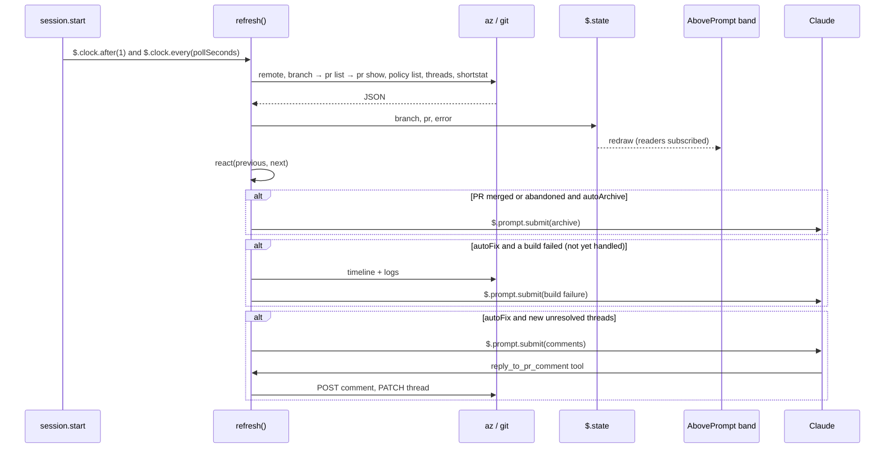

# Architecture

```text
plugins/ado-pr/
├── .claude-plugin/plugin.json   manifest, userConfig options, the state contract's path
├── hooks/
│   ├── hooks.json               { "modules": ["./register.tsx"] }
│   ├── register.tsx             hooks: band, CI menu, pane, commands, tools, polling
│   ├── ado.ts                   the az/git layer; takes an exec function, so tests can stand in for it
│   ├── status.ts                pure: policy → check, rollup, comments, shortstat, phase
│   ├── remote.ts                pure: Azure Repos remote URL parsing
│   └── prompts.ts               what Claude is asked for Create PR, auto-fix, comments, archive
├── types/index.d.ts             $.state contract (PluginState['ado-pr'])
└── tests/                       claude plugin test: unit tests plus a mounted band on terminal and desktop
```

The Azure layer (`ado.ts`, `status.ts`, `remote.ts`) knows nothing about Claude Code's UI. `register.tsx` is the only file that touches `$`.

## State

A chat's pull requests belong to the chat, not to the branch the checkout is on. Each chat keeps its list in `$.store` under its session id (the transcript's name), so the list survives restarts and never leaks into another chat of the same folder:

| Store key | |
|---|---|
| `bindings:<session id>` | `{ orgUrl, id }` for every PR the chat created, found or linked, in that order. One bar each. |
| `snapshots:<session id>` | the last read of each, drawn at once when a chat is re-opened, while a refresh runs |

A PR is added to the chat by:
- **Create PR** and the `create_pull_request` tool
- Claude's own `az repos pr create` (the id is read from its output)
- **Find PR**, which scans the chat's history for PR links and ids and keeps those of the checkout's repository
- `/ado-pr link <id>`

It is removed by **Remove from chat** in its CI panel, or `/ado-pr unlink [id]`.

The session's `$.state` mirrors what the bars draw:

| Key | |
|---|---|
| `branch` | org, project, repo and current branch from `origin`, used for Create PR and Find PR only |
| `bindings`, `prs` | the chat's PRs and their last read |
| `error` | the last `az` error, already turned into an instruction |
| `busy` | a label while an action runs |
| `openMenu` | the PR whose CI panel is open |
| `isHidden` | the bars were closed with × |
| `autoFix`, `autoArchive` | the switches. Auto-merge lives on each PR, as Azure DevOps auto-complete. |
| `mine` | rows of the `/ado-pr mine` pane |
| `handled` | `build:<id>` and `thread:<pr>:<id>` already handed to Claude, so nothing is handed over twice |

## When it reads

Every read has a live `$` of its own, so no single event has to fire:

- 1 ms after `session.start`, then every `pollSeconds`
- after each `prompt.submit` (at most every 15 s) and each `turn.complete` (at most every 5 s)
- whenever the band is drawn and the last read is older than `pollSeconds`
- after Claude's `git push` / `checkout` / `switch` / `merge` / `rebase` / `pull` and `az repos pr` commands
- on **Refresh**, `/ado-pr refresh`, and the Claude tools

A read re-reads the checkout and every bound PR. It never looks a PR up by branch.

## Flow



Reads run one at a time, and each runs with its caller's own `$`, because a `$` lives only as long as the dispatch that handed it over. A `git push`, `git checkout`/`switch`/`merge`/`rebase`/`pull` or `az repos pr` command that Claude runs through Bash refreshes the bar before the tool result returns.
